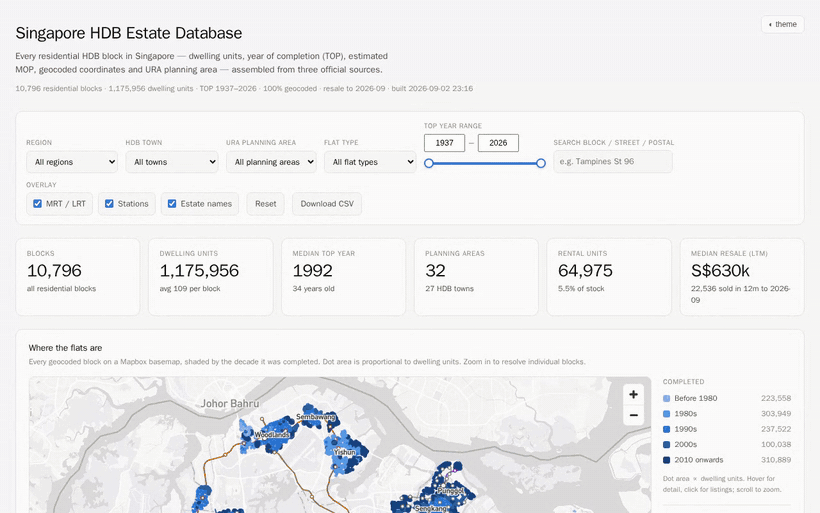

<div align="center">

# Singapore HDB Estate Database

**Every residential HDB block in Singapore on one map** — dwelling units, year of completion,
estimated MOP, geocoded coordinates, URA planning area and resale prices.

[](https://sg-hdb-estates.tz-sg.workers.dev/)
[](#schema--blocks)
[](#schema--blocks)
[](#pipeline)
[](#resale-prices)
[](https://www.onemap.gov.sg/legal/opendatalicence.html)
[](https://buymeacoffee.com/zphzpj4gcka)



</div>

---

## What it does

Three official datasets, joined into one queryable database and a single map you can actually
use. Click any block and you get its project name, unit mix, age, estimated MOP, what its flats
sold for in the last twelve months, and links straight to live listings.

| | |
|---|---|
| **10,796** residential blocks | every one geocoded, 100% |
| **1,175,956** dwelling units | with the full 1-room → Executive mix |
| **239,583** resale transactions | Jan 2017 onwards, joined at 100.00% |
| **212** MRT/LRT stations | plus all 10 lines, drawn from OpenStreetMap |
| **55** URA planning areas | assigned by point-in-polygon, not by name matching |

Filters for region, HDB town, planning area, flat type and year of completion flow through
**every** number on the page — tiles, map, charts, both tables, the CSV export and the
PropertyGuru links.

## Quick start

```bash
python3 serve.py            # -> http://127.0.0.1:8642/
python3 serve.py -p 9000    # pick a different port
```

## Contents

| File | What it is |
|---|---|
| `data/hdb.sqlite` | SQLite database — `blocks` (one row per block) and `estates` (one row per HDB town) |
| `data/hdb_blocks.csv` | Block-level table, CSV |
| `data/hdb_estates.csv` | Estate-level rollup, CSV |
| `data/hdb_blocks.json` | Block-level table, JSON |
| `site/index.html` | The report — self-contained except for Mapbox basemap tiles |
| `site/vendor/` | Mapbox GL JS 3.25.0, vendored so the page needs no CDN |
| `site/config.js` | Generated: Mapbox token + style URLs (git-ignored) |
| `site/rail.geojson` | MRT/LRT line geometry from OpenStreetMap |
| `site/stations.geojson` | 212 MRT/LRT stations, with codes, interchange and build status |
| `site/data.json` | Dictionary-encoded payload the report loads |

## Deploying (Cloudflare Workers, static assets)

The report is a pure static bundle — no server runtime. `wrangler.jsonc` declares it as an
assets-only Worker (no `main` script), so Cloudflare serves `site/` directly. Requests to
static assets are free and unlimited; only Worker-script invocations are billed, and there
is no script here.

| Setting | Value |
|---|---|
| Build command | `bash build.sh` |
| Deploy command | `npx wrangler deploy` |
| Build variable | `MAPBOX_TOKEN` = your `pk.` token |
| Build variable (optional) | `TIP_URL` = tip-jar link, `TIP_LABEL` = its wording |

`TIP_URL` drives an optional footer tip link. Leave it unset and nothing renders — the
link can never appear broken or empty. Any platform works (Ko-fi, Buy Me a Coffee,
GitHub Sponsors, a Stripe payment link); it is just a URL.

The `MAPBOX_TOKEN` field is not offered when the project is first created, so the first
deploy will succeed *without* a basemap (the map falls back to the SVG scatter). Add the
variable under Settings → Build → Variables and secrets, then re-run the deployment.

`build.sh` regenerates `site/config.js` from `MAPBOX_TOKEN` at deploy time, so the token lives
in Cloudflare's secret store and never enters the repo. Without it the build still succeeds and
the map falls back to the dependency-free SVG scatter.

`site/_headers` is honoured by Workers static assets and sets the cache policy (vendored libraries immutable for a year, data
revalidated hourly). Without it a static host would re-send ~3 MB on every visit;
`serve.py` sets the same headers locally but is not deployed.

**Restrict the token by URL in your Mapbox account before going public.** A `pk.` token is
necessarily visible to the browser, so the URL restriction — not secrecy — is what protects it.
Hosting is free; Mapbox is the cost that scales, at 50k map loads/month on the free tier.

## Sources

| Source | Publisher | Supplies |
|---|---|---|
| HDB Property Information (`d_17f5382f26140b1fdae0ba2ef6239d2f`) | HDB via data.gov.sg | blocks, dwelling units, flat-type mix, year completed |
| OneMap Search API | Singapore Land Authority | latitude / longitude / postal code per block |
| Master Plan 2019 Planning Area Boundary (`d_4765db0e87b9c86336792efe8a1f7a66`) | URA via data.gov.sg | planning area + region polygons |
| OpenStreetMap (Overpass API) | OSM contributors, ODbL | MRT/LRT line and station geometry |
| Resale Flat Prices (`d_8b84c4ee58e3cfc0ece0d773c8ca6abc`) | HDB via data.gov.sg | 239,583 resale transactions, Jan 2017 onwards |

## Pipeline

```
fetch_data.py  data.gov.sg -> data/hdb_property.csv, data/planning_area.geojson
geocode.py     block + street -> OneMap -> data/geocode_cache.jsonl   (resumable)
build_db.py    CSV + geocodes + point-in-polygon -> sqlite / csv / json
build_site.py  -> site/data.json + site/config.js
fetch_rail.py  Overpass -> site/rail.geojson, site/stations.geojson  (cached)
build_resale.py resale.csv -> data/resale_agg.json
validate.py    QA the assembled database (exits non-zero on failure)
serve.py       -> http://127.0.0.1:<port>/
```

A GitHub Action (`.github/workflows/refresh-data.yml`) runs this monthly and on demand.
It commits only if `validate.py` passes, so a bad refresh fails the run rather than
publishing itself. Because `data/geocode_cache.jsonl` is committed, the scheduled run
only calls OneMap for genuinely new blocks — seconds, against ~94 minutes for a cold run.

Rebuild everything after a source refresh:

```bash
python3 geocode.py && python3 build_db.py && python3 build_site.py
```

### Project names and listing links

OneMap returns a `BUILDING` name for many blocks — the HDB project name ("Casa Clementi",
"Bishan Ridges"). It sits inside the `ADDRESS` string between the road name and the postal
code, so `build_db.py` recovers it without re-geocoding. Two traps:

- OneMap sometimes returns a **co-located facility** instead of the project — childcare
  centres, police posts, "HDB Public Shelters" (54 blocks). Those are filtered out by pattern.
- **"Depot Heights" is a real Telok Blangah estate**, so `DEPOT` must never go in that
  filter pattern. It was the one false positive when the filter was first written.

Clicking a block opens a bubble with the project name and three PropertyGuru searches —
block, project, street — narrowest to broadest, because a single block often has no live
listing. The URL scheme, verified September 2026:

```
https://www.propertyguru.com.sg/property-for-sale?freetext=<query>&property_type=H
    &property_type_code[]=4A&property_type_code[]=4NG...
```

Returns `HDB 4 Room Flats for Sale - <location>`. The older `/singapore-property-listing/`
path now 403s. `PG_BASE` and `PG_CODES` in `index.html` are the only things to change if
PropertyGuru alters the scheme.

### Flat-type filter

Selecting a flat type filters to blocks containing that type **and** switches every count in
the report — tiles, map dot size, charts, estate table, block table — to that type's units,
so the whole page describes the stock the filter names. It also flows into the PropertyGuru
links as `property_type_code[]`.

### Resale prices

`build_resale.py` folds 239,583 transactions into two aggregates — the raw file cannot ship
to a browser, but these can:

* **per (block, flat type)** — what flats in that block actually sold for, shown in the map bubble
* **per (town, flat type, year)** — 1,272 rows, enough to drive a trend chart that filters live

The join is on block + street + flat type and lands **239,580 of 239,583 (100.00%)**. The one
unmatched block (82 Macpherson Lane) is absent from HDB's current property list, almost
certainly a SERS demolition.

**The headline is the last-twelve-month median, not an all-period one.** A median across the
whole 2017–2026 span understates current value by **23% at the median** (p25 +13%, p75 +33%),
because the market rose sharply from 2020 — averaging the two is not a price estimate.
63% of block×type pairs sold within the LTM window; the rest carry their most recent actual
sale, muted and dated so it cannot be mistaken for a current median. Single-sale medians are
muted for the same reason.

The trend chart aggregates HDB-town medians weighted by transaction count. Per-block yearly
medians were considered and rejected: at a median of ~12 sales per pair over ten years, a
one-year bucket is often a single transaction, which is a price, not a median.

### Rail overlay

`fetch_rail.py` pulls MRT/LRT route relations from OpenStreetMap and writes
`site/rail.geojson`, drawn under the block dots in the operators' own line colours
(identity colours riders already know, so deliberately not from the report's data palette).
Lines under construction are dashed. The raw Overpass response is cached in
`data/overpass_rail.json` — delete it to refetch.

**Stations** (212, of which 34 are interchanges and 24 still under construction) are drawn
as hollow marks — a surface-coloured centre with a line-coloured ring — so they never read as
data points. Interchanges are larger with a neutral ring, since no single line owns them.
They sit *above* the block dots: judging which blocks are near a station is the point of the
overlay, and under a dense cluster they would simply disappear. Names appear from zoom 12.5.

Stations are filtered by Singapore station-code pattern (`NS12`, `EW24`, `BP6`…), which
cleanly excludes the Sentosa Express, the Changi Skytrain and the KTM stations that the
bounding box also returns. Note the query uses a **bounding box, not `area["ISO3166-1"="SG"]`** —
the area lookup reliably times out on Overpass's dispatcher.

Two further OSM quirks the script handles, both of which silently lose data if ignored:
the Bukit Panjang and Punggol LRT are tagged `route=monorail`, not `light_rail`, so querying
light rail alone drops two of the three LRT networks; and the same query also returns the
Sentosa Express and the Changi Skytrain, which are filtered out.

### Estate names

The 27 HDB estate names are drawn as their own Mapbox symbol layer, positioned at the
**median** lat/lon of each estate's blocks — not the mean, which an outlying pocket of blocks
would drag into empty space. Larger estates win label collisions (`symbol-sort-key` on unit
count), so at full extent 24 of 27 show and the rest appear as you zoom.

While estate names are on, two basemap layers are switched off to avoid printing two sets of
names over each other: `settlement-subdivision-label` (which already labels Yishun, Bedok,
Tampines…) and `airport-label` (which prints air-base codes — WSAG, TGA, QPG — that mean
nothing in a housing report). Turning the toggle off restores both.

### Basemap

The map draws the blocks as a Mapbox GL circle layer over Mapbox Light / Dark, switched with
the report's theme. The token is read at build time from `MAPBOX_TOKEN` or `.mapbox_token`
and written to the git-ignored `site/config.js`, so it is never baked into source:

```bash
echo 'pk.your_token' > .mapbox_token && python3 build_site.py
```

A Mapbox public (`pk.`) token is necessarily visible to the browser — that is what it is for —
so restrict it by URL in your Mapbox account if the report is ever exposed beyond localhost.
**Without a token, or offline, the map falls back to a dependency-free SVG scatter** of the same
coordinates; nothing else in the report changes.

The ordinal colour ramp is reversed in dark mode on purpose. On a dark ground the *bright* end
reads as the loud one, so reversing keeps the newest estates the salient end in both themes
rather than flipping emphasis to the oldest.

`geocode.py` is resumable — it appends to `data/geocode_cache.jsonl` and skips anything
already cached, so it is safe to interrupt and restart. It paces itself against OneMap's
rate limit (adaptive: it widens the request interval on HTTP 429 and decays back down).
Set `ONEMAP_TOKEN` to use an authenticated quota, which raises the ceiling.

## Schema — `blocks`

| Column | Notes |
|---|---|
| `blk_no`, `street`, `address`, `postal` | address; `address`/`postal` come from OneMap |
| `project` | HDB project/precinct name ("Bishan Ridges") where OneMap has one — 49.9% of blocks |
| `town_code`, `town` | HDB's own estate code and name (e.g. `TAP` / Tampines) |
| `planning_area`, `region` | **URA** planning area and region, by point-in-polygon |
| `lat`, `lon`, `geocode_match` | coordinates; match is `exact` (block + road), `block`, `fuzzy`, or `missing` |
| `top_year` | year of completion, as published by HDB |
| `mop_year_est`, `mop_status` | **estimated** — see caveats |
| `age_years`, `lease_remaining_est` | derived from `top_year` |
| `max_floor_lvl`, `total_units` | height and dwelling units |
| `units_1r` … `units_exec`, `units_multigen`, `units_studio`, `units_rental` | flat-type mix |
| `has_commercial`, `has_market_hawker`, `has_mscp`, `has_pavilion` | non-residential facilities in the block |

## Caveats — read before using the derived columns

- **MOP is an estimate.** The Minimum Occupation Period runs 5 years from key collection,
  which HDB does not publish per block. `mop_year_est` uses `top_year + 5` as a proxy, so it
  can be out by a year either way. Prime and Plus flats (from 2024) carry a **10-year** MOP
  and are not separately flagged in the source data.
- **Lease remaining is approximate.** `99 - (current year - top_year)`. The 99-year lease
  commences shortly *before* completion, so this reads slightly low.
- **HDB town ≠ URA planning area.** They are different administrative geographies and the
  report carries both. HDB's "Central Area" spreads across URA's Outram, Rochor, Kallang and
  Downtown Core; URA's "Tampines" does not exactly match HDB's Tampines town.
- **`year_completed` is the block's TOP, not the estate's.** Estates are built in phases, so
  an estate's TOP range spans decades (Tampines: 1981–2026).
- **Residential blocks only.** The source lists 13,357 blocks; the 10,796 with
  `residential = Y` are kept. The rest are standalone carparks, markets and commercial blocks.
- **`total_units` includes rental flats; the `units_*` type columns do not.** HDB's flat-type
  columns count *sold* flats only, so `sold + rental = total`. Across the stock that is
  1,110,981 sold + 64,975 rental = 1,175,956. Summing the type columns alone undercounts by 5.5%.
- Counts are **dwelling units sold**, HDB's own field. Blocks under construction appear with
  their planned unit counts.

---

## Attribution

Contains information from **HDB Property Information**, **Resale Flat Prices** and the
**Master Plan 2019 Planning Area Boundary**, accessed from
[data.gov.sg](https://data.gov.sg), and from the **OneMap** Search API, accessed from
[onemap.gov.sg](https://www.onemap.gov.sg) — all made available under the terms of the
[Singapore Open Data Licence version 1.0](https://www.onemap.gov.sg/legal/opendatalicence.html),
which permits commercial and non-commercial use with attribution.

Rail and station geometry © [OpenStreetMap](https://www.openstreetmap.org/copyright)
contributors, licensed under [ODbL](https://opendatacommons.org/licenses/odbl/).
Basemap © [Mapbox](https://www.mapbox.com/about/maps/) © OpenStreetMap.

**This project is not endorsed by, and implies no official status with, HDB, URA or SLA.**
The same notice appears in the footer of the report itself, as the licence requires.

## Licence

The code in this repository is released under the MIT Licence. The **data** it fetches and
redistributes remains under its own terms — Singapore ODL v1.0 for the government datasets,
ODbL for the OpenStreetMap geometry. ODbL is share-alike: if you redistribute a derived
*database* that includes the rail or station layers, that derivative carries ODbL too.

## Support

This report is free, has no tracking, and costs nothing to run beyond a Mapbox tile quota.
If it saved you an afternoon of scrolling property portals:

<a href="https://buymeacoffee.com/zphzpj4gcka">
  
</a>
